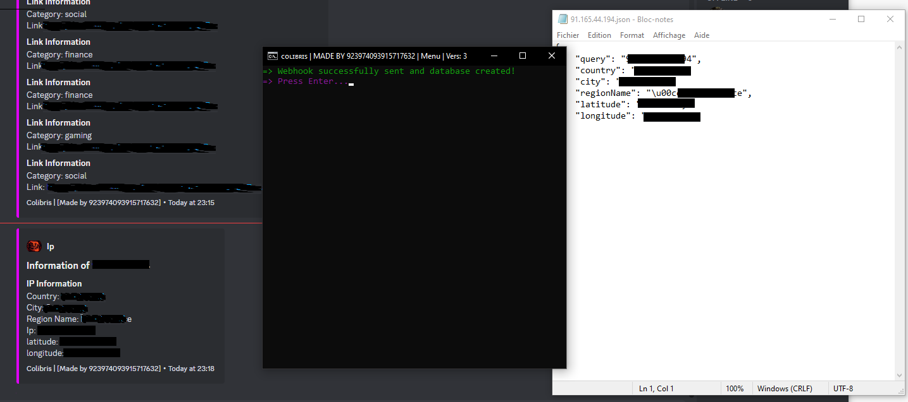
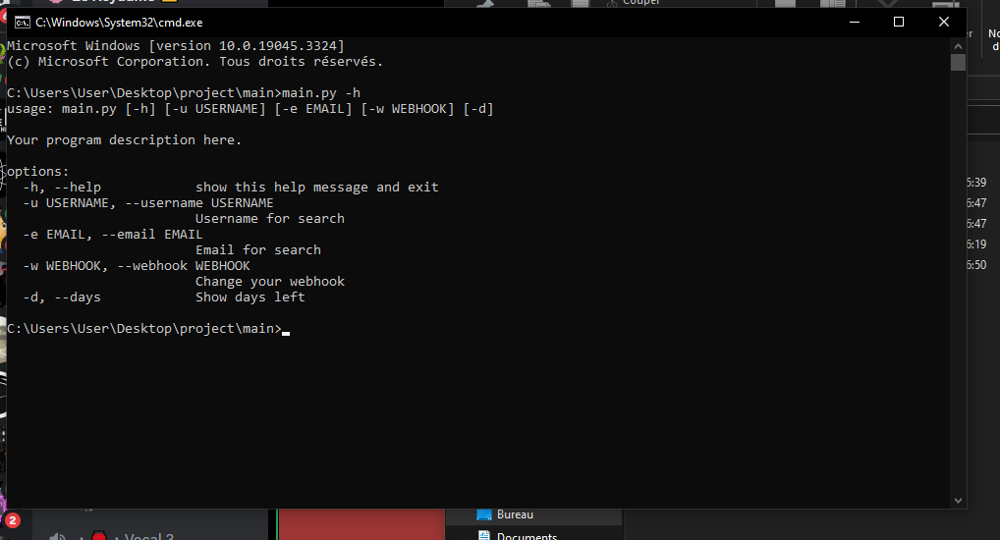
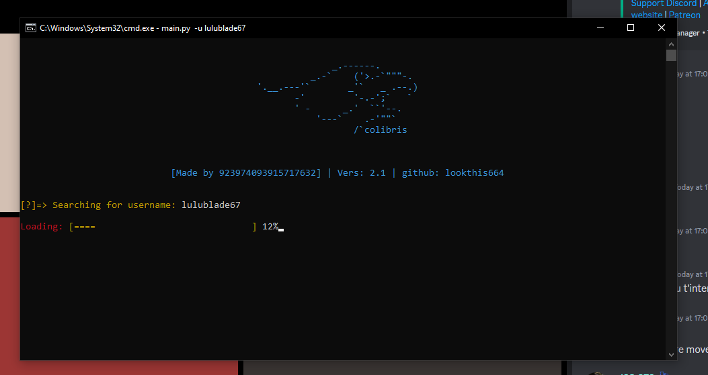

Colibris will be a software that will allow you to have information on an e-mail address, an IP address, a telephone number, a username, and other things will come later. For the moment, only 2 of these 4 functions are working. I've been working on it alone for quite a while now. I'm thinking of offering 2 free versions if my work makes any noise. One will be released on 24 August and another in more than 2 months. This will give you an idea of my software! Here are a few screenshots of the interface and the data it will be able to collect

!!Update of the 10/08/2023!!
I've added the number of days remaining for the software to the interface, trying to fix a few problems. 

!!Update of the 11/08/2023!!
I've changed the interface to make it easier to understand. For the moment there are two commands: "py main.py -u {username}" and -h. I'll tell you about the new interface tomorrow! 

!!Update of the 12/08/2023!!
I created my own library to make my script faster. Now a "modules" file has been created. I also need to work on the "async def" and my email module. I'll see what I can do later, but I'm taking my time.
Here is the new display 

If you have any questions or special requests, please send a message to the following discord number: 923974093915717632
