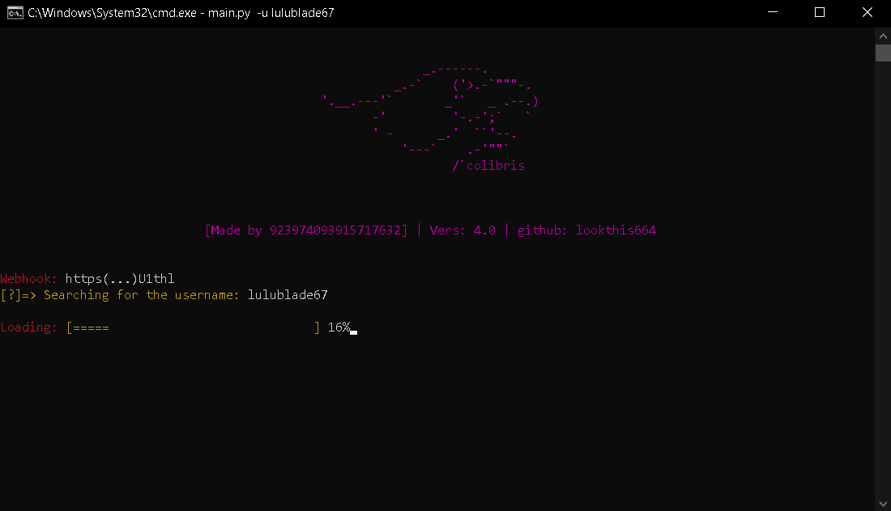

# COLIBRIS
<p align="center">
  
  <br>
New version of my script this should be better and accurate.

<h1 align="center">
  <br>
  <a href="">
    
  </a> 
  </div>
  <br>
  COLIBRIS OSINT
  <br>
</h1>

<h4 align="center">OSINT tools work with web scraping.</h4>

<p align="center">
  <a href="">
    
  </a>
  <a href="">
    
  </a>
  <a href="">
      
  </a>
</p>

<p align="center">
  
</p>


## **Features**
- [x] Get links from a username
- [X] Automated metadata harvesting from a generated link (WIP)
- [X] Reactive to command

## **_Requirements_**
```
pip install -r requirements.txt
```
This installs all requirements needed

⚠️ You need to have a good Wi-Fi connection in order to fully utilize the power of the software.


### All command here:
| **👀 Username command** |
| ------------- | 
| py src/main.py | 

*yes, more compact than the oldest version x)*

# Author

> Github: lookthis664

Colibris osint
