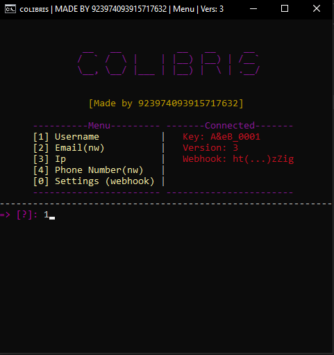

Colibris will be a software that will allow you to have information on an e-mail address, an IP address, a telephone number, a username, and other things will come later. For the moment, only 2 of these 4 functions are working. I've been working on it alone for quite a while now. I'm thinking of offering 2 free versions if my work makes any noise. One will be released on 24 August and another in more than 2 months. This will give you an idea of my software! Here are a few screenshots of the interface and the data it will be able to collect

