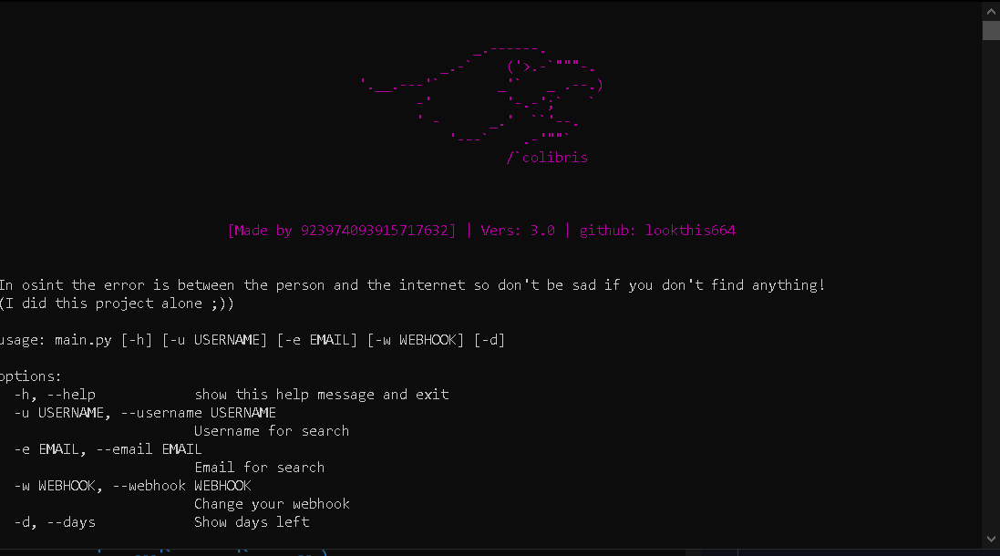
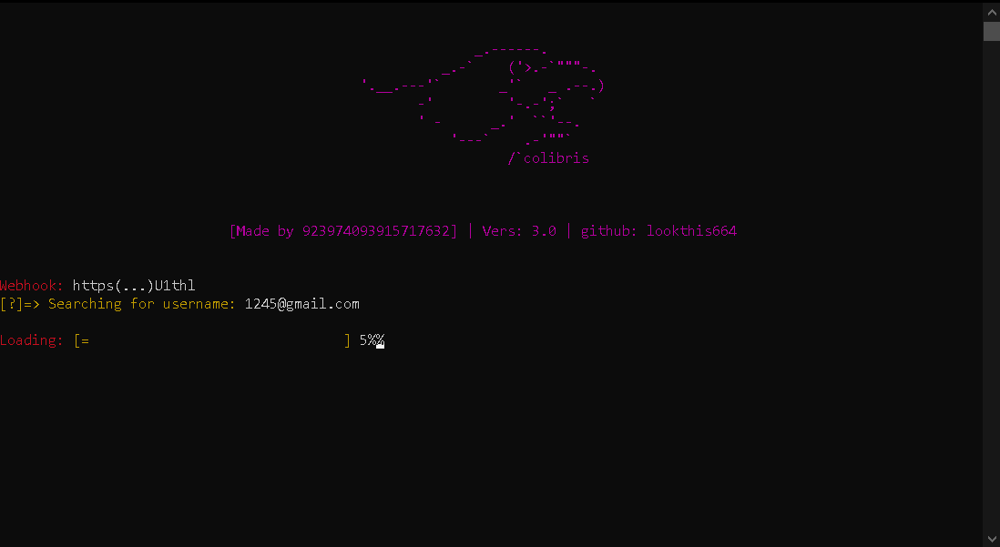

**Features**
- [x] Get links & category from a username
- [X] Know if an email address has been breached
- [X] Reactive to command

**How do I install it? First of all, you need to launch the config file and then run "Setup.bat "**.

**How do I use it? First you need to set up a discord webhook with the following command:**
```
py main.py -w {enter your webhook}
```
The help command is as follows:
```
py main.py -h
```

To search you have 2 commands, here they are:
```
py main.py -u {username}
py main.py -e {email}
```


!!UPDATE OF THE 03/09/2023!!
A new version is ready. This new feature will allow you to find out if an email address has been leaked on pastebin (a pastebin dump).
Tomorrow you'll be able to enjoy it to the full

If you have any questions or special requests, please send a message to the following discord number: 923974093915717632


