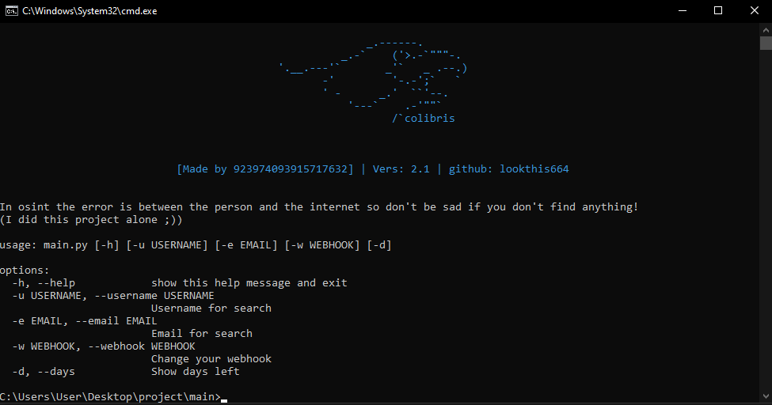

"Colobris" is an osint software that works thanks to scraping! It's currently one of the most promising projects I'm working on. I hope you like it!


How do I use it? First you need to set up a discord webhook with the following command:
```
py main.py -w {enter your webhook}
```
The help command is as follows:
```
py main.py -h
```
```
To search you have 2 commands, here they are:
py main.py -u {username}
py main.py -e {email}
```
If you have any questions or special requests, please send a message to the following discord number: 923974093915717632
