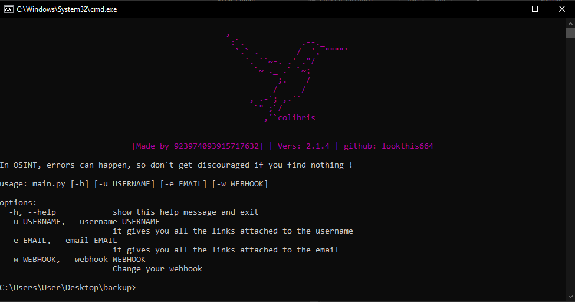

# COLIBRIS
<p align="center">
  
  <br>
  Prevent error if no webhook is given

<h1 align="center">
  <br>
  <a href="">
    
  </a> 
  </div>
  <br>
  COLIBRIS OSINT
  <br>
</h1>

<h4 align="center">OSINT tools work with web scraping.</h4>

<p align="center">
  <a href="">
    
  </a>
  <a href="">
    
  </a>
  <a href="">
      
  </a>
</p>

<p align="center">
  
</p>


## **Features**
- [x] Get links & category from a username
- [X] Know if an email address has been breached
- [X] Get all pastebin dump with an email
- [X] Reactive to command

## **_Requirements_**
```
pip install -r requirements.txt
```
This installs all requirements needed

⚠️ You need to have a good Wi-Fi connection in order to fully utilize the power of the software.


## **_Startup_**
**First you need to set up a discord webhook with the following command:**
Use this to start it with Python:
```
py src/colibris.py -w {enter your webhook}
// OR
python3 src/colibris.py -w {enter your webhook}
```


### All command here:
| **👀 Username command**  | **📩 Email command** | **❓ Help command** | **📋 Webhook command** |
| ------------- | ------------- |  ------------- | ------------- | 
| py src/colibris.py -u {username}  | py src/colibris.py -e {email} |  py src/colibris.py -h | py src/colibris.py -w {webhook}| 

# Author

> Github: lookthis664

> Discord: trop_booste_sur_mw3

Colibris osint

